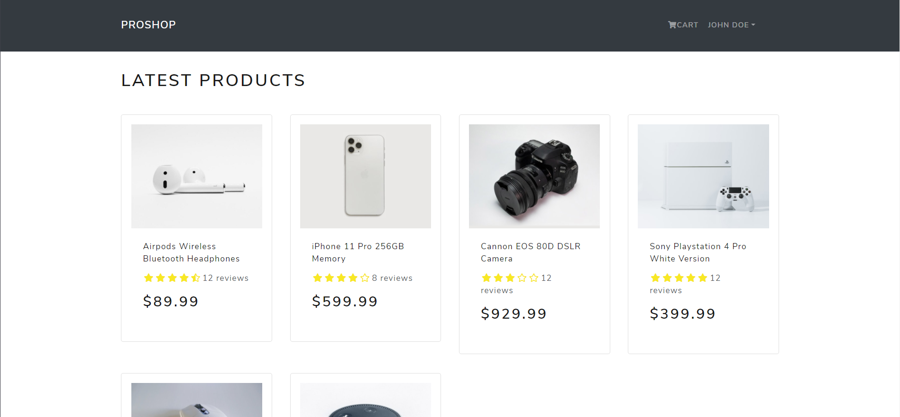
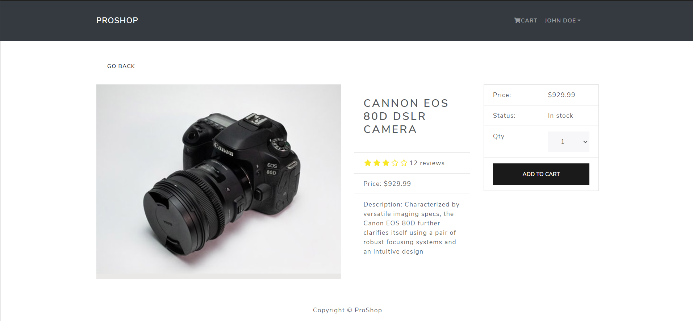
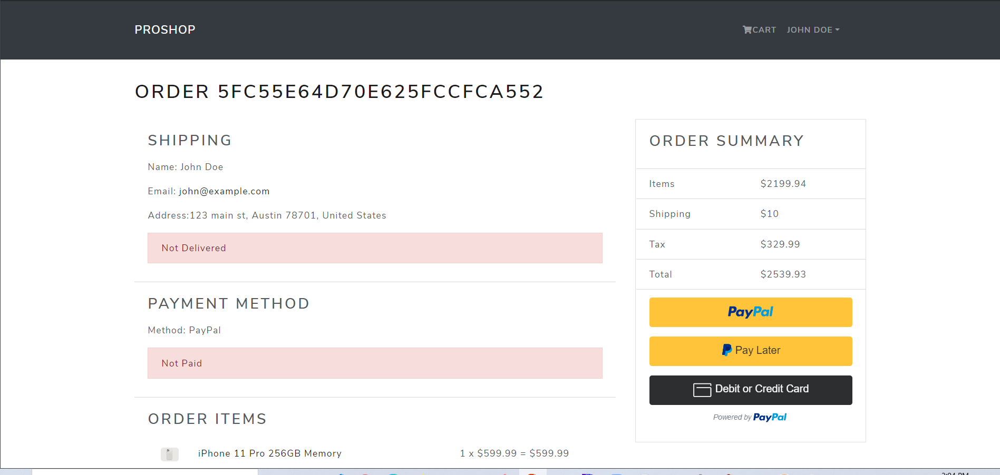

# Pro Shop

## Description
A modern end-to-end, pedagogical e-commerce application built with the MERN Stack and Redux.  Features CMS-style admin database control and PayPal payment integration.  

##### Homescreen

##### Single Product View

##### Payment Checkout View

Visit site [here](https://proshop-xo.herokuapp.com/)

## Table of Contents
  * [Installation](#installation)
  * [Usage](#usage)
  * [License](#license)
  * [Technologies](#technologies)
  * [Contributing](#contributing)
  * [Testing](#testing)
  * [Questions](#questions)
  
## Installation
Clone project to a directory on your local machine and cd into proshop directory.  Run <$ npm install> to install dependencies.  See package.json for other available scripts.

## Usage
Run <$ npm run dev> to launch application and launch on localhost development server.  Create user on sign up page or log in to john@example.com with password '123456' as a guest.  Select products to view and add to cart.  Complete mock payment with PayPal integration. 

## License 
This project is covered under the MIT license 

## Technologies 
MERN Stack, Redux, React Router, React Bootstrap, Bootswatch, PayPal API, Multer 

## Contributing
To see the guidelines adopted for contributing to this project, please view the [Contributor Covenant](https://www.contributor-covenant.org/version/2/0/code_of_conduct/code_of_conduct.txt)

## Testing
Tests coming soon

## Questions
Visit me at GitHub  
[christopherConcannon](https://github.com/christopherConcannon)
  
If you have any questions or would like to contact me, please email me at  
[cmcon@yahoo.com](mailto:cmcon@yahoo.com)
